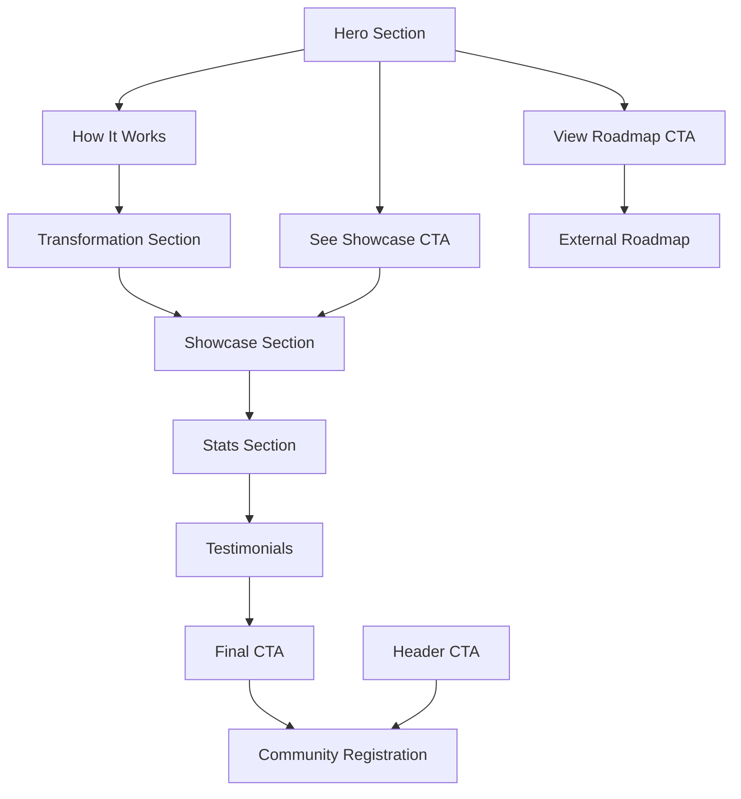

# Vibecoding Landing Page - Product Requirements Document

## 1. Product Overview

A modern, conversion-focused landing page for Vibecoding Ascension, an AI-powered coding bootcamp that transforms traditional developers into AI orchestrators in 10 intensive days.

The landing page serves as the primary marketing and conversion tool to attract developers interested in learning AI-assisted development methodologies, showcasing the bootcamp's unique value proposition and driving community sign-ups.

Target market: Developers, software engineers, and tech professionals seeking to enhance their skills with AI-powered development tools and methodologies.

## 2. Core Features

### 2.1 User Roles

| Role | Registration Method | Core Permissions |
|------|---------------------|------------------|
| Visitor | No registration required | Can browse all content, view testimonials, access showcase |
| Community Member | Email registration via CTA buttons | Access to private community, bootcamp enrollment |

### 2.2 Feature Module

Our Vibecoding landing page consists of the following main sections:

1. **Header Navigation**: logo, navigation menu, primary CTA button
2. **Hero Section**: headline, value proposition, key metrics display, skill progression chart
3. **How It Works Section**: 3-step methodology explanation with visual elements
4. **Transformation Section**: three key promises with detailed descriptions
5. **Showcase Section**: capstone project examples and portfolio pieces
6. **Stats Section**: key performance metrics and social proof
7. **Testimonials Section**: student success stories and reviews
8. **Final CTA Section**: conversion-focused call-to-action
9. **Footer**: comprehensive site navigation and legal links

### 2.3 Page Details

| Page Name | Module Name | Feature description |
|-----------|-------------|---------------------|
| Landing Page | Header Navigation | Display Vibecoding logo, navigation links (How It Works, Roadmap, Showcase, Community), prominent "Join Community" CTA button |
| Landing Page | Hero Section | Present main headline "Where Code and Creativity Meet Confidence", value proposition text, dual CTAs (View Roadmap, See Showcase), metrics display (15+ skills, 3 projects), interactive skill progression chart |
| Landing Page | How It Works | Explain 3-step methodology: Describe the Vibe, AI Generates, Refine & Deploy with visual icons and descriptions |
| Landing Page | Transformation Promises | Showcase three key outcomes: Master AI Collaboration, Ship Full-Stack App, Earn Certification with detailed explanations |
| Landing Page | Showcase Section | Display capstone project examples, crypto dashboard preview, highlight AI-human collaboration results |
| Landing Page | Stats Display | Present key metrics: 10 Intensive Days, 100+ Pioneers Trained, 5.0★ Rating, 95% Completion Rate |
| Landing Page | Testimonials | Feature three student testimonials with names, titles, and detailed success stories |
| Landing Page | Final CTA | Present compelling conversion copy with "Join Our Private Community" button |
| Landing Page | Footer | Organize links into categories: Bootcamp, Company, Resources with comprehensive navigation and copyright |

## 3. Core Process

**Visitor Journey Flow:**
Visitors land on the hero section, learn about the methodology through "How It Works", understand transformation benefits, view showcase examples, see social proof through stats and testimonials, and convert through multiple CTA touchpoints.

## 4. User Interface Design

### 4.1 Design Style

- **Primary Colors**: Deep tech blue (#1a365d), vibrant accent blue (#3182ce)
- **Secondary Colors**: Clean white (#ffffff), subtle gray (#f7fafc), success green (#38a169)
- **Button Style**: Modern rounded buttons with subtle shadows and hover animations
- **Typography**: Clean sans-serif font (Inter or similar), hierarchy with bold headings (32-48px), body text (16-18px)
- **Layout Style**: Card-based sections, generous whitespace, centered content with max-width containers
- **Icons**: Modern line icons for methodology steps, minimalist style consistent with tech aesthetic
- **Animations**: Subtle fade-ins, smooth transitions, interactive hover states

### 4.2 Page Design Overview

| Page Name | Module Name | UI Elements |
|-----------|-------------|-------------|
| Landing Page | Header | Fixed navigation bar, logo left-aligned, horizontal menu center, CTA button right with blue gradient background |
| Landing Page | Hero Section | Large centered headline with gradient text, two-column layout with text left and metrics/chart right, dual CTA buttons with primary/secondary styling |
| Landing Page | How It Works | Three-column grid layout, numbered steps with large icons, consistent card styling with subtle shadows |
| Landing Page | Transformation | Three-column grid, icon headers, bold titles, descriptive text, consistent spacing and alignment |
| Landing Page | Showcase | Full-width background image/video, overlay text, centered content with compelling visuals |
| Landing Page | Stats | Four-column horizontal layout, large numbers with descriptive text, subtle background color |
| Landing Page | Testimonials | Three-column grid, quote styling, profile images, names and titles, star ratings |
| Landing Page | Final CTA | Centered content, large headline, prominent button, contrasting background color |
| Landing Page | Footer | Multi-column layout, organized link categories, social media icons, copyright text |

### 4.3 Responsiveness

Mobile-first responsive design with breakpoints at 768px (tablet) and 1024px (desktop). Touch-optimized interactions for mobile devices, with larger tap targets and simplified navigation. Grid layouts collapse to single-column on mobile, maintaining readability and usability across all devices.