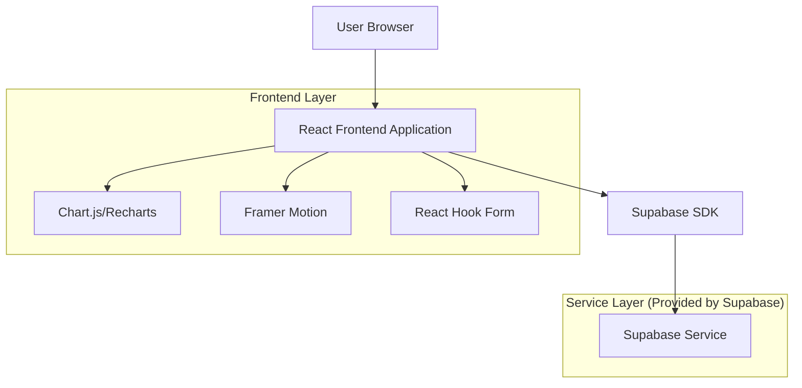
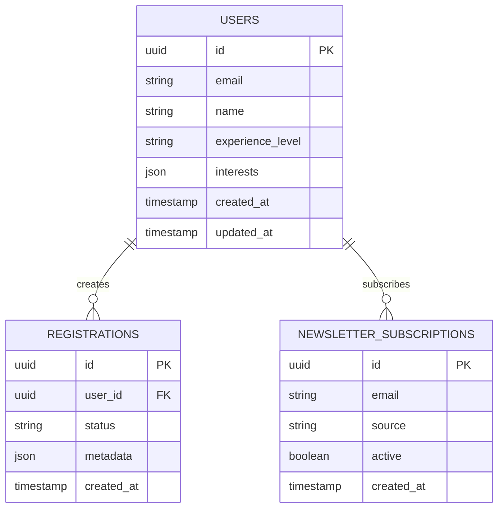

# Vibecoding Landing Page - Technical Architecture Document

## 1. Architecture Design



## 2. Technology Description

- Frontend: React@18 + TypeScript@5 + Tailwind CSS@3 + Vite@5
- Animation: Framer Motion@11 for smooth animations and transitions
- Charts: Recharts@2 for skill progression visualization
- Forms: React Hook Form@7 for community registration
- Backend: Supabase (Authentication, Database, Real-time subscriptions)
- Deployment: Vercel (optimized for React applications)

## 3. Route Definitions

| Route | Purpose |
|-------|---------|
| / | Main landing page with all sections |
| /roadmap | External link to detailed bootcamp roadmap |
| /showcase | External link to student project showcase |
| /community | Community registration and login portal |
| /privacy | Privacy policy page |
| /terms | Terms of service page |

## 4. API Definitions

### 4.1 Core API

Community registration and authentication
```
POST /api/auth/signup
```

Request:
| Param Name | Param Type | isRequired | Description |
|------------|------------|------------|-------------|
| email | string | true | User email address |
| name | string | true | Full name |
| experience_level | string | true | Coding experience (beginner, intermediate, advanced) |
| interests | string[] | false | Areas of interest in AI development |

Response:
| Param Name | Param Type | Description |
|------------|------------|-------------|
| success | boolean | Registration status |
| user_id | string | Unique user identifier |
| message | string | Success or error message |

Example:
```json
{
  "email": "developer@example.com",
  "name": "John Developer",
  "experience_level": "intermediate",
  "interests": ["AI development", "Full-stack", "React"]
}
```

Newsletter subscription
```
POST /api/newsletter/subscribe
```

Request:
| Param Name | Param Type | isRequired | Description |
|------------|------------|------------|-------------|
| email | string | true | Subscriber email |
| source | string | true | Subscription source (hero, footer, etc.) |

Response:
| Param Name | Param Type | Description |
|------------|------------|-------------|
| subscribed | boolean | Subscription status |
| message | string | Confirmation message |

## 5. Data Model

### 5.1 Data Model Definition



### 5.2 Data Definition Language

Users Table (users)
```sql
-- Create users table
CREATE TABLE users (
    id UUID PRIMARY KEY DEFAULT gen_random_uuid(),
    email VARCHAR(255) UNIQUE NOT NULL,
    name VARCHAR(100) NOT NULL,
    experience_level VARCHAR(20) CHECK (experience_level IN ('beginner', 'intermediate', 'advanced')),
    interests JSONB DEFAULT '[]',
    created_at TIMESTAMP WITH TIME ZONE DEFAULT NOW(),
    updated_at TIMESTAMP WITH TIME ZONE DEFAULT NOW()
);

-- Create index for email lookups
CREATE INDEX idx_users_email ON users(email);
CREATE INDEX idx_users_created_at ON users(created_at DESC);

-- Grant permissions
GRANT SELECT ON users TO anon;
GRANT ALL PRIVILEGES ON users TO authenticated;
```

Registrations Table (registrations)
```sql
-- Create registrations table
CREATE TABLE registrations (
    id UUID PRIMARY KEY DEFAULT gen_random_uuid(),
    user_id UUID REFERENCES users(id) ON DELETE CASCADE,
    status VARCHAR(20) DEFAULT 'pending' CHECK (status IN ('pending', 'confirmed', 'completed')),
    metadata JSONB DEFAULT '{}',
    created_at TIMESTAMP WITH TIME ZONE DEFAULT NOW()
);

-- Create indexes
CREATE INDEX idx_registrations_user_id ON registrations(user_id);
CREATE INDEX idx_registrations_status ON registrations(status);
CREATE INDEX idx_registrations_created_at ON registrations(created_at DESC);

-- Grant permissions
GRANT SELECT ON registrations TO anon;
GRANT ALL PRIVILEGES ON registrations TO authenticated;
```

Newsletter Subscriptions Table (newsletter_subscriptions)
```sql
-- Create newsletter subscriptions table
CREATE TABLE newsletter_subscriptions (
    id UUID PRIMARY KEY DEFAULT gen_random_uuid(),
    email VARCHAR(255) NOT NULL,
    source VARCHAR(50) NOT NULL,
    active BOOLEAN DEFAULT true,
    created_at TIMESTAMP WITH TIME ZONE DEFAULT NOW()
);

-- Create indexes
CREATE INDEX idx_newsletter_email ON newsletter_subscriptions(email);
CREATE INDEX idx_newsletter_source ON newsletter_subscriptions(source);
CREATE INDEX idx_newsletter_active ON newsletter_subscriptions(active);

-- Grant permissions
GRANT SELECT ON newsletter_subscriptions TO anon;
GRANT ALL PRIVILEGES ON newsletter_subscriptions TO authenticated;

-- Initial data for testing
INSERT INTO newsletter_subscriptions (email, source) VALUES
('test@example.com', 'hero_section'),
('demo@vibecoding.com', 'footer');
```